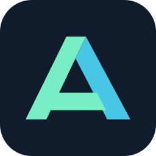

<p align="center"></p>
<h1 align="center">Local Agent AI Station</h1>
<p align="center">Локальные модели, агенты и GPU — в одной Windows-панели.</p>
<p align="center"><b>Русский</b> · <a href="README.uk.md">Українська</a> · <a href="README.md">English</a></p>
<p align="center"><a href="https://github.com/Wave-is/laas/releases">Скачать раннюю версию</a> · <a href="docs/GETTING_STARTED.ru.md">Начало работы</a> · <a href="https://github.com/Wave-is/laas/issues">Сообщить об ошибке</a></p>

**3.0.0-alpha.1 · Ранняя версия · Windows 10/11 x64 · MIT**

Station объединяет запуск моделей, интерфейсы агентов, состояние оборудования
и управление из трея. Подходит для CPU и разного количества GPU;
возможности видеокарт зависят от оборудования и драйверов.

| Раздел | Возможности |
|---|---|
| Дашборд | Статусы модели, сервера и агента, показатели GPU, запуск и остановка |
| Агенты | Обнаружение Qwen Code/Desktop, Hermes, Pi Coding Agent, OpenClaw и Aider; официальные релизы; управление своими процессами |
| Модели | Профили llama.cpp/llama-swap, выбор устройств, запуск и выгрузка |
| Трей | Быстрые команды, два настраиваемых канала показателей с цифрами и заполнением фона |
| Службы | Локальные процессы и удалённые ComfyUI/HTTP worker с отключаемым опросом |
| Автозапуск | Отдельный выбор старта с Windows и запуска служб, модели, агентов; задержка и отмена |

## Установка

Скачайте **LocalAgentAIStation-3.0.0-alpha.1-Setup-x64.exe** из
[Releases](https://github.com/Wave-is/laas/releases). Установщик доступен на русском,
украинском и английском. Python включён. Установщик один раз просит права администратора; программа работает без них.
Интерфейс приложения пока русский. Агенты, веса моделей и движки устанавливаются
отдельно. При первом запуске они автоматически не включаются.

Программа: `%ProgramFiles%\Local Agent AI Station`.
Данные: `%LOCALAPPDATA%\LocalAgentAIStation`. Есть ярлыки «Пуска» и рабочего стола,
удаление средствами Windows и обновление поверх установленной версии.
Подробности — [начало работы](docs/GETTING_STARTED.ru.md).

## Границы ранней версии

- Подписи кода и автоматического обновления пока нет.
- Мониторинг GPU включён. Для TCC/WDDM нужны совместимые NVIDIA и отдельный
  привилегированный helper; установщик его не ставит. Полная приёмка установленной
  новой службы ещё не завершена. См. [GPU helper](docs/GPU_MODE_HELPER.md).
- Физические тесты: CPU, одна выбранная NVIDIA и две NVIDIA на одном ПК.
  Тесты моделируют 0/1/2/3/4/8 GPU; другие реальные конфигурации не сертифицированы.
- Есть интеграционные проверки Qwen Desktop, Pi и OpenClaw. Поддержка адаптера
  не гарантирует работу с каждой будущей версией агента. См. [проверки](docs/VALIDATION.md).
- Подключение инструмента генерации изображений к агентам и длительная проверка
  максимального контекста ещё в работе. Запись удалённой службы сама по себе не создаёт инструмент агента.

## Разработка

[Участие](CONTRIBUTING.md) · [Архитектура](docs/ARCHITECTURE.md) ·
[Сборка релиза](docs/RELEASING.md) · [Дальнейшая работа](ROADMAP.md).
[HANDOFF](docs/HANDOFF.md) сохраняет состояние разработки; частные настройки,
журналы и сведения о ПК в Git не включаются. Ошибки можно описывать на любом из трёх языков.

```powershell
python -m venv .venv
.\.venv\Scripts\python.exe -m pip install -r requirements-dev.txt
.\build_installer.ps1 -Python .\.venv\Scripts\python.exe -ISCC 'C:\Program Files (x86)\Inno Setup 6\ISCC.exe'
```

Перед упаковкой зафиксируйте изменения в Git. Подробности зависимостей — в
[RELEASING](docs/RELEASING.md). Из исходников: `.venv\Scripts\pythonw.exe main.pyw --no-startup`.

[Лицензия MIT](LICENSE), [лицензии зависимостей](docs/THIRD_PARTY.md).
Station — независимый проект, не связанный с производителями агентов и моделей.
